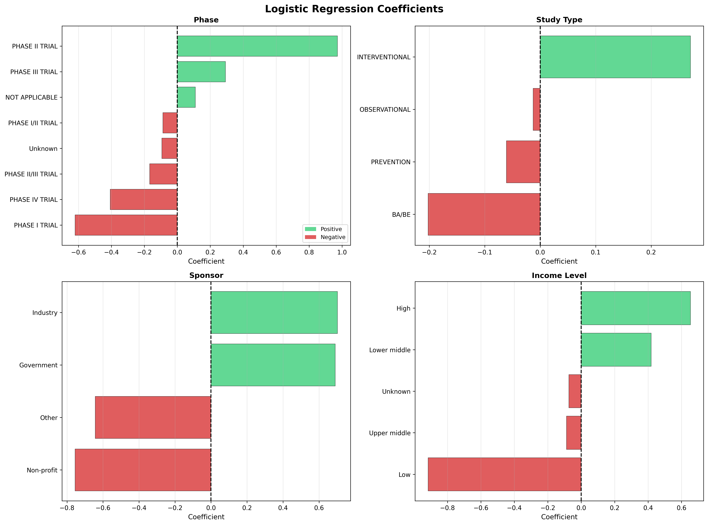
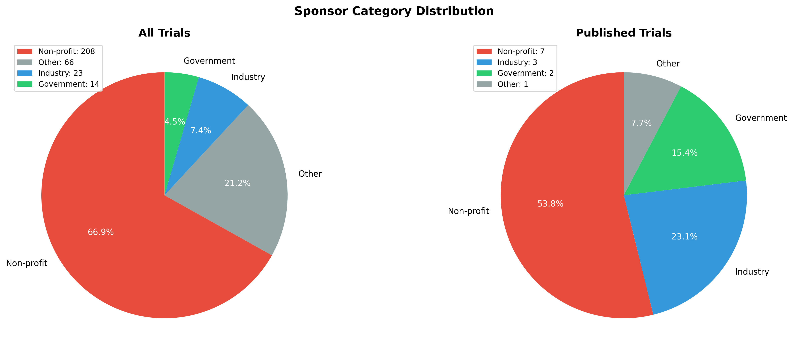
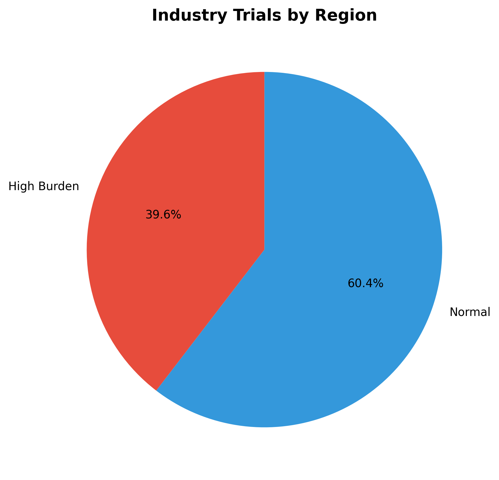

# Project Overview

## Dataset
- **Source:** WHO International Clinical Trials Registry Platform (ICTRP)
- **Period:** 1999-2023 (25 years)
- **Trials:** 311 valid trials (315 raw, 4 outliers removed)
- **Countries:** 62
- **Diseases:** Chagas, Schistosomiasis, Endemic worms, Visceral leishmaniasis

---

# Research Questions

1. What factors are associated with results publication?
2. Can network analysis reveal country partnerships?
3. What proportion funded by pharmaceutical companies?
4. Are children and pregnant women included in studies?
5. Which drugs are studied for Chagas disease?

---

# RQ 2.2.1: Publication Factors

## FINDING: Severe Publication Gap

::: columns
:::: column
**Statistics:**

- Publication rate: **4.2%** (13/311)
- Unpublished: **95.8%** (298/311)

**Method:**

- Logistic Regression
- Features: phase, study type, sponsor, income level
::::

:::: column
**Factors INCREASING Publication (+):**

1. Phase II trials (+0.972)
2. Industry sponsors (+0.702)
3. Government sponsors (+0.690)
4. High-income countries (+0.654)
5. Lower-middle income (+0.419)
::::
:::

**Implication:** Severe publication bias. Industry and high-income countries publish more.

---

# RQ 2.2.1: Publication Predictors (cont.)

**Factors DECREASING Publication (-):**

1. Low-income countries (-0.916) ❌
2. Non-profit sponsors (-0.755) ❌
3. "Other" sponsors (-0.643) ❌
4. Phase I trials (-0.621) ❌
5. Phase IV trials (-0.408) ❌

{width=80%}

---

# RQ 2.2.3: Pharmaceutical Funding

## FINDING: Low Pharma Investment

::: columns
:::: column
**Sponsor Distribution:**

- Non-profit: **66.9%** (208 trials)
- Other: 21.2% (66 trials)
- **Industry: 7.4%** (23 trials) ⚠️
- Government: 4.5% (14 trials)

**Implication:** NGOs carry the research burden. Pharma severely underinvests.
::::

:::: column
{width=100%}
::::
:::

---

# RQ 2.2.3: Industry vs Disease Burden

## Do pharma trials align with high-burden regions?

**High-burden countries:** India, Mexico, Tanzania, Bangladesh, Bolivia, Kenya, Egypt, Côte d'Ivoire

::: columns
:::: column
**Industry Trials (23 total):**

- High Burden: 19 trials (39.6%)
- Normal regions: 29 trials (60.4%)

**Implication:** 60% NOT in high-burden regions!
::::

:::: column
{width=100%}
::::
:::

---

# RQ 2.2.2: Country Collaborations

## FINDING: Strong International Partnerships

**Network Overview:**

- Multi-country trials: 43
- Countries in network: 43
- Collaborative connections: 163

**Top 5 Hub Countries:**

| Rank | Country | Partners | Collaborations | Centrality |
|------|---------|----------|----------------|------------|
| 1 | 🇦🇷 Argentina | 22 | 47 | 0.294 |
| 2 | 🇰🇭 Cambodia | 18 | 22 | 0.275 |
| 3 | 🇧🇷 Brazil | 18 | 32 | 0.159 |
| 4 | 🇻🇳 Vietnam | 15 | 17 | 0.094 |
| 5 | 🇪🇹 Ethiopia | 13 | 21 | 0.070 |

**Implication:** Argentina and Cambodia are major research hubs.

---

# RQ 2.2.4: Special Populations

## FINDING: Limited Inclusion

::: columns
:::: column
**👶 Children:**

- No explicit tracking field
- Data limitation: inferred from age ranges
- Estimated ~50% may include children

**🤰 Pregnant Women:**

- Explicitly included: **12 trials (3.8%)**
- Excluded/unclear: 96.2%
::::

:::: column
**Implication:**

Vulnerable populations severely underrepresented.

Evidence gaps for special groups.
::::
:::

---

# RQ 2.2.5: Drug Trends (Chagas)

## FINDING: Benznidazole Dominates

**Chagas Disease Analysis:**

- Total trials: 88
- Method: Regex extraction from intervention text

**Top 5 Drugs:**

1. **Benznidazole** - 21 trials (main treatment)
2. Placebo - 10 trials
3. E1224 - 6 trials (experimental)
4. Nifurtimox - 5 trials
5. E1224 Placebo - 4 trials

**Implication:** Limited diversity in drug candidates.

---

# How Results Address Research Goals

**Main Goal:** "Clarify evolution of NTD trial activities and trends"

✅ **Temporal Trends:** 25-year coverage (1999-2023)

✅ **Geographic Distribution:** 62 countries, hub countries identified

✅ **Funding Structure:** Non-profit dominance (67%), Pharma minimal (7%)

✅ **Publication Patterns:** Severe gap (4.2%), factors identified

✅ **Collaboration:** Network analysis reveals partnerships

---

# Key Discoveries Summary

## 3 Critical Findings:

1. **🚨 PUBLICATION CRISIS**
   - 95.8% of trials don't publish results
   - Evidence base severely limited

2. **💰 FUNDING GAP**
   - Pharma: 7.4%, Non-profits: 67%
   - NGOs carry the burden

3. **👥 REPRESENTATION GAP**
   - Pregnant women: 3.8%
   - Children: unclear/underrepresented

---

# Data Limitations

**Challenges We Faced:**

1. **Severe Publication Bias**
   - Only 13 published trials
   - Limited analysis power

2. **Data Completeness**
   - 4 outliers removed
   - Missing values in fields
   - No explicit child participant field

3. **Classification Accuracy**
   - Keyword-based sponsor classification
   - May miss edge cases

4. **Temporal Imbalance**
   - Trial distribution varies by year

---

# Methodological Limitations

**Analytical Challenges:**

::: columns
:::: column
**1. Logistic Regression**

- ⚠️ Small published sample (n=13)
- ⚠️ Severe class imbalance (4% vs 96%)
- May affect reliability

**2. Network Analysis**

- Country-level only
- Doesn't capture institutions
- Edge weights simplistic
::::

:::: column
**3. Drug Extraction**

- Regex-based: may miss variations
- Chagas only (not all diseases)

**Mitigation:**

- ✅ Stratified sampling
- ✅ Transparent documentation
- ✅ Robust cleaning pipeline
::::
:::

---

# Recommendations for Improvement

::: columns
:::: column
**Data Collection:**

1. Standardize special population fields
2. Mandate result publication
3. Expand to post-2023 trials

**Methodological:**

1. Handle class imbalance (SMOTE)
2. Try ensemble methods (Random Forest)
3. Institution-level network analysis
4. NLP for drug extraction
::::

:::: column
**Policy Implications:**

1. **Mandate publication** (address 96% gap)
2. **Incentivize pharma investment**
3. **Target high-burden regions**
4. **Design inclusive trials** (special populations)
::::
:::

---

# Strengths of Our Analysis

✅ **Comprehensive Cleaning**

- Robust outlier detection
- Automated classification
- Income level mapping

✅ **Multi-Method Approach**

- Statistics + ML + Network + Text Mining

✅ **Reproducible Pipeline**

- 5 modular scripts
- Complete documentation
- Clear execution order

✅ **Transparent**

- All limitations acknowledged
- CODE_DOCUMENTATION.txt provided

✅ **Practical Insights**

- Actionable recommendations
- Policy implications

---

# Key Takeaways

## What This Means:

NTD research needs **structural reform**:

- Better incentives for publication
- Increased pharma engagement
- Improved data standards
- Inclusive trial design

## Our Contribution:

- Evidence for policy makers
- Guidance for funders
- Roadmap for researchers

**311 trials analyzed → 5 questions answered → 3 critical gaps identified**

---

# Thank You

## Questions?

**Project Materials:**

- Code: 5 Python scripts
- Documentation: CODE_DOCUMENTATION.txt
- Data: 12 CSV files, 3 visualizations

**Group 16 - Lancaster University**

Peizhe Jiang • Congyao Ren • Zixu Wang • Alaghwani Balsam
